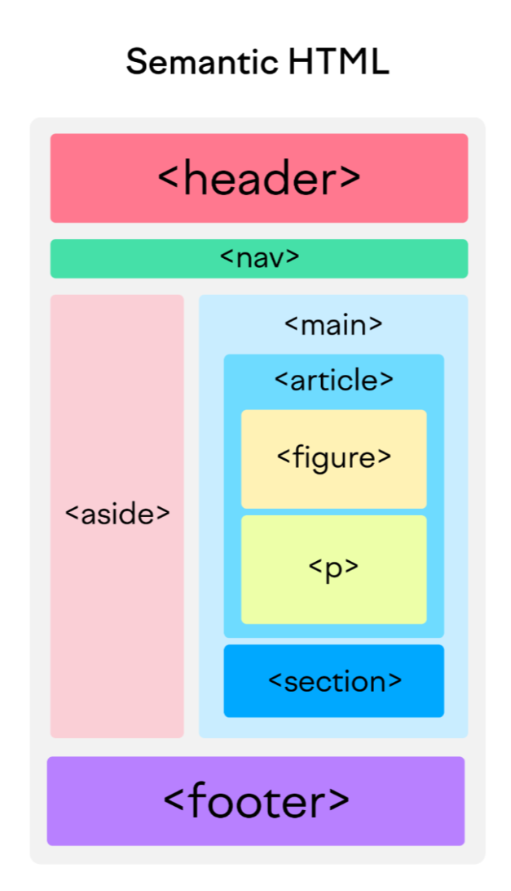

# git-html-css-challenges-1

## Recreating following webpage.

## Updating the HTML and CSS according to the challenges requirements.

* updated description on title tag.
* with this challenge I learned about the semantic HTML tags such as header, footer, section, article and aside, and made changes on my repo.
## Semantic HTML reference

## My github repo link is as follow:
https://github.com/salidamaharjan/git-html-css-challenges-1

## My github page link is as follow:
https://salidamaharjan.github.io/git-html-css-challenges-1/
